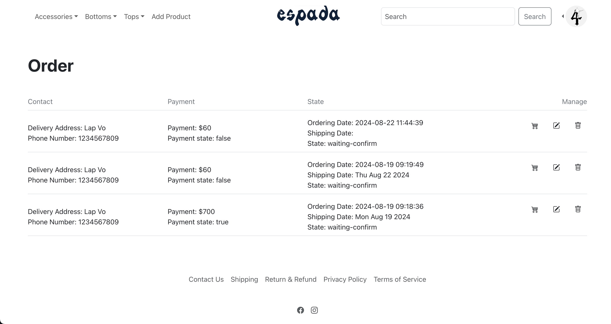

# Espada Streetwear Store

This is an ecommerce website that sells streetwear clothes, inspired by [ILSN](https://madebyilsn.com).

## Table of Contents

- [Tech Stack](#i-tech-stack)
- [Features](#ii-features)
  - [Authentication](#1-authentication)
  - [Product Searching](#2-product-searching)
  - [Payment](#3-payment)
  - [Order Management](#4-order-management)
  - [Product Upload/Update](#5-product-uploadupdate)
  - [Clean Up](#6-clean-up)
  - [Database Schema](#7-project-database)
- [Running the Application](#iii-running-the-application)
  - [Prerequisites](#prerequisites)
  - [Database Setup](#database-setup)
  - [Running the Frontend](#frontend-setup)
  - [Running the Backend](#backend-setup)
  - [Viewing API Documentation](#view-api-documentation)

## I. Tech Stack

- **Languages:** Java, TypeScript, HTML, CSS
- **Frameworks & Libraries:** Spring Boot, ReactJS, Bootstrap
- **Testing:** Postman
- **API Documentation:** Swagger UI
- **Database Management System:** MySQL

## II. Features

This website creates an admin account upon the first run. The admin has full access to all features of the website.

### 1. Authentication

This project uses JWT for user authentication.

**How it works:**

- **Registering:**
  - Users click on the **Join Us** button to register if they don't have an account.
  - After filling in all necessary information, a verification link is sent to the user's email.
  - If the link is not clicked within 5 minutes, it will expire, and the user will receive a new link upon attempting to log in.
  

- **Logging In:**
  - Users fill in their username and password.
  - The client sends a request to verify the information. If valid, the server responds with an access token and a refresh token.
  - Both tokens have unique IDs that are saved in the database. These IDs are used to invalidate the tokens after refreshing or logging out.

- **Refresh Token:**
  - When the access token expires (valid for 3600 seconds), the client sends a refresh request containing the refresh token.
  - The server checks the validity of the refresh token. If valid, it saves the IDs of both the refresh token and the access token in the database, generates new tokens, and sends them back to the client.
  
### 2. Product Searching

There are two ways to search for a product:

- **Search by Product Name:**
  - Users can type a keyword to search for products, without needing to know the full name.

- **Search by Product ID:**
  - This feature is only available to the admin.

### 3. Payment

Users can pay for their orders using two methods:

- **Cash On Delivery**
- **Pay with VNPAY**  
  

### 4. Order Management

- **User Order Page:**
  - Users can track their order status (waiting for confirmation, preparing, shipping, delivered, or returned) and view the shipping date.
  
  

- **Admin Order Management Page:**
  - Admins can delete orders, update order status, and view order details.
  
  
  

### 5. Product Upload/Update

These pages are for admin use only.

### 6. Clean Up

- The server automatically cleans up orders after every season (quarterly).
- Expired tokens are cleaned up automatically after 24 hours.

### 7. Project Database

### 8. Error Code

| HTTP Status           | Error Side (Developer, Client, Undefined) | Error Code |
|-----------------------|-------------------------------------------|------------|
| Internal Server Error | Undefined                                 | 9999       |
| Internal Server Error | Developer                                 | 1xxx       |
| Bad Request           | Client                                    | 2xxx       |
| Unauthorized          | Client                                    | 3xxx       |
| Forbidden             | Client                                    | 4xxx       |
| Not Found             | Client                                    | 5xxx       |

## III. Running the Application

### Prerequisites

- **Java 17**
- **NodeJS**
- **MySQL**

### Database Setup

Run the `database_creation.sql` file to create the database.

### Frontend Setup

Ensure NodeJS is installed by checking the version with `npm --version`.

1. Navigate to the `/Espada-Store-main/frontend/espada-streetwear-store` directory in the terminal.
2. Run `npm install`. Once the `node_modules` directory is created, proceed to the next step.
3. Run `npm start`. Ensure port 3000 is available.

The static website should now be visible.

### Backend Setup

Ensure Java 17 is installed by checking the version with `java --version`.

1. Navigate to the `/Espada-Store-main/backend/spring-boot-espada-store` directory in the terminal.
2. Run `./mvnw clean package -DskipTests`. Once the `target` directory is created, proceed to the next step.
3. Navigate to the `target` directory in the terminal.
4. Run `java -jar spring-boot-espada-store-0.0.1-SNAPSHOT.jar`. Ensure port 8080 is available.

### View API Documentation

1. Navigate to the `target` directory of the backend in the terminal.
2. Run `java -jar spring-boot-espada-store-0.0.1-SNAPSHOT.jar`. Ensure port 8080 is available.
3. Open a browser and go to: `http://localhost:8080/api/swagger-ui/index.html#/`